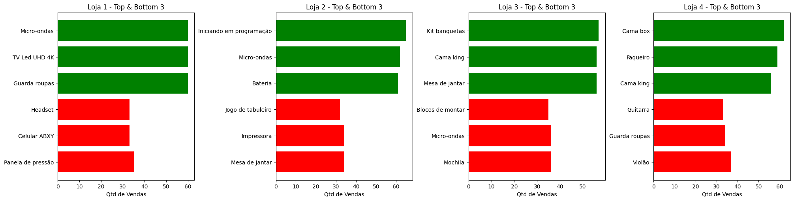

# 🏬 Alura Store - Relatório de Análise de Dados

## 🎯 Propósito da Análise

Este projeto tem como objetivo analisar os dados de vendas de uma rede fictícia de lojas — a **Alura Store** — para identificar padrões, desempenho por loja, produtos e categorias mais vendidos, avaliações médias, impacto do frete e outros indicadores que possam embasar uma tomada de decisão estratégica.

---

## 🗂️ Estrutura do Projeto

```
alura-store-challenge/
├── images/              # Gráficos e visualizações geradas
│   └── grafico-vendas-produto.png
├── notebooks/           # Notebooks utilizados na análise
│   └── analise-dados.ipynb
├── README.md            # Este arquivo
```


---

## 📈 Exemplos de Gráficos e Insights

### 💰 Faturamento Bruto por Loja

| Loja   | Faturamento Bruto |
|--------|--------------------|
| Loja 1 | R$ 1.534.509,12    |
| Loja 2 | R$ 1.488.459,06    |
| Loja 3 | R$ 1.464.025,03    |
| Loja 4 | R$ 1.384.497,58    |

---

### 🛍️ Top 5 Categorias por Loja

| Loja   | Categorias Principais | Vendas |
|--------|------------------------|--------|
| Loja 1 | Móveis                | 465    |
|        | Eletrônicos           | 448    |
|        | Brinquedos            | 324    |
|        | Eletrodomésticos (*)  | 312    |
|        | Esporte e Lazer (*)   | 284    |
| Loja 2 | Móveis                | 442    |
|        | Eletrônicos           | 422    |
|        | Brinquedos            | 313    |
|        | Eletrodomésticos      | 305    |
|        | Esporte e Lazer       | 275    |
| Loja 3 | Móveis (*)            | 499    |
|        | Eletrônicos (*)       | 451    |
|        | Brinquedos            | 315    |
|        | Eletrodomésticos      | 278    |
|        | Esporte e Lazer       | 277    |
| Loja 4 | Móveis                | 480    |
|        | Eletrônicos           | 451    |
|        | Brinquedos (*)        | 338    |
|        | Eletrodomésticos      | 254    |
|        | Esporte e Lazer       | 277    |

---

### 🌟 Avaliação Média por Loja

| Loja   | Avaliação Média |
|--------|------------------|
| Loja 3 | 4.05 *           |
| Loja 2 | 4.04             |
| Loja 4 | 4.00             |
| Loja 1 | 3.98             |

#### 🏆 Top Categorias Melhor Avaliadas

| Loja   | Categoria                 | Avaliação |
|--------|---------------------------|-----------|
| Loja 1 | Brinquedos (*)           | 4.08      |
|        | Instrumentos Musicais    | 4.05      |
|        | Eletrodomésticos (*)     | 4.03      |
| Loja 2 | Móveis                   | 4.09      |
|        | Eletrodomésticos         | 4.07      |
|        | Utilidades Domésticas    | 4.07      |
| Loja 3 | Brinquedos (*)           | 4.2       |
|        | Móveis                   | 4.1       |
|        | Utilidades Domésticas    | 4.07      |
| Loja 4 | Esporte e Lazer          | 4.05      |
|        | Livros                   | 4.04      |
|        | Utilidades Domésticas    | 4.01      |

---

### 📦 Produtos Mais e Menos Vendidos

<p align="center">
  
</p>

---

### 🚚 Frete Médio por Loja

| Loja   | Frete Médio | Soma dos Fretes |
|--------|-------------|------------------|
| Loja 1 | R$ 34,69    | R$ 81.837,97     |
| Loja 2 | R$ 33,62    | R$ 79.314,16     |
| Loja 3 | R$ 33,07    | R$ 78.022,66     |
| Loja 4 | R$ 31,28    | R$ 73.755,88     |

---

### 🧾 Faturamento Líquido por Loja

| Loja   | Faturamento Líquido |
|--------|----------------------|
| Loja 1 | R$ 1.452.671,15      |
| Loja 2 | R$ 1.409.144,90      |
| Loja 3 | R$ 1.386.002,37      |
| Loja 4 | R$ 1.310.741,70      |

---

## 🧠 Resumo

> A loja 1 possui o maior faturamento, tanto bruto como líquido, tendo seu maior volume de vendas em móveis e eletrônicos. Leva vantagem na venda de eletrodomésticos e produtos de esporte e lazer. Apesar de ter a menor avaliação entre as lojas, esse número se justifica por ser a que mais vende. Seus produtos mais vendidos estão alinhados com suas categorias principais, mostrando um perfil bem estabelecido. Possui a maior média de frete, indicando maior distância dos consumidores, mas a diferença de cerca de 10% em relação à menor média não tem impacto real no faturamento.
>
> A loja 2 possui o segundo maior faturamento, tanto bruto como líquido, com maior volume de vendas em móveis e eletrônicos. Não possui vantagem numérica sobre outras lojas, mas é a segunda mais bem avaliada, com boas avaliações nas categorias principais. Alguns produtos mais vendidos não estão alinhados com o perfil da loja, mas isso pode ser justificado pela demanda local. A média de frete é a segunda maior, com uma diferença de 6,96% em relação à menor média, sem impacto real no faturamento.
>
> A loja 3 tem o segundo menor faturamento, mas apresenta desempenho superior em vendas de móveis e eletrônicos. É a loja com a melhor avaliação geral e destaque nas categorias de brinquedos e móveis. Seus produtos mais vendidos estão alinhados com as categorias de destaque. A segunda menor média de frete é positiva para uma loja focada em móveis, podendo indicar boa localização em relação à demanda.
>
> A loja 4 possui o menor faturamento, tanto bruto como líquido, com uma diferença de R$ 141.929,45 em relação à loja líder. Tem volume de vendas em móveis e eletrônicos, e vantagem em brinquedos. Apesar da segunda menor avaliação e menor volume de vendas, seus produtos vendidos seguem o perfil da empresa. Mesmo com a menor média de frete, isso não se converte em lucro. A diversificação de categorias parece equivocada, com destaque excessivo em brinquedos e utilidades domésticas.
>
> **Análise final:**  
> A loja 4 é a maior candidata ao encerramento das atividades. Embora tenha uma média de avaliação razoável, essa métrica mascara sua baixa quantidade de vendas e o fraco desempenho geral. Mesmo localizada estrategicamente (frete baixo), a loja não consegue converter isso em lucro. Seu desempenho ruim em eletrodomésticos e eletrônicos compromete o faturamento. A diversificação excessiva em categorias menos lucrativas também prejudica os resultados. As vendas totais entre as lojas são praticamente iguais (2.359), com a loja 4 tendo uma a menos — irrelevante estatisticamente, mas reforçando sua baixa conversão.

---

## 🛠️ Como Executar

1. Clone este repositório:
   ```bash
   git clone https://github.com/seu-usuario/alura-store-challenge.git
   cd alura-store-challenge
